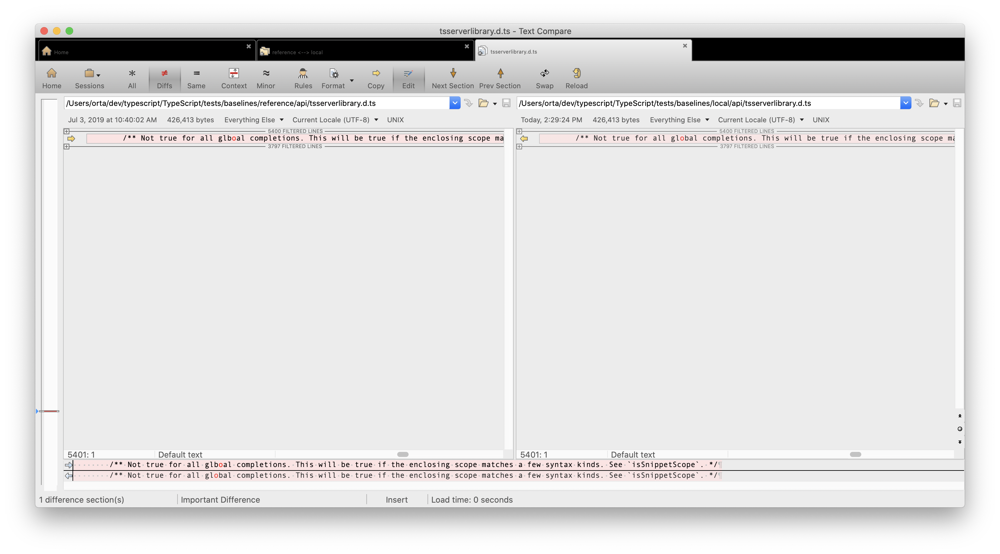

# Baselines

Baseline tests are effectively large folder-based snapshot tests. Like [fourslash](./fourslash), these tests are
somewhat integration level. These test generally test the internals of the compiler, they do this by you creating
a TypeScript file where the snapshot result is a symbol map of all the symbols in that file and a list of all
raised errors then compiling the tests.

### How to make a baseline

1. Make a new file: ` touch tests/cases/compiler/overloadFunctionsNotEqualToGenerics.ts`. Add some TypeScript to it.
2. d


### How to amend a baseline

`gulp runtests` will run all the baselines eventually. Or `gulp runtests -i --tests=baseline` should speed things up
if you only want to see those specific changes.

All of the baselines exist in `tests/baselines/local/`. They kinda look like:

```sh
$ tree tests/baselines/local/
tests/baselines/local/
└── api
    ├── tsserverlibrary.d.ts
    └── typescript.d.ts

1 directory, 2 files
```

This lets you know that two tests have changed from what you expect. They live in `local/api`, so you can compare
the folders. I normally use [Kaleidoscope](https://www.kaleidoscopeapp.com), but the team loves 
[Beyond Compare](https://scootersoftware.com) - it's a bit Windows-y but does a good job showing you how the 
folder infrastructure differs.




Once you're happy with the new baselines, you can run `gulp baseline-accept` to move them into the codebase. 
You will be able to see your diffs in git now. :+1:
